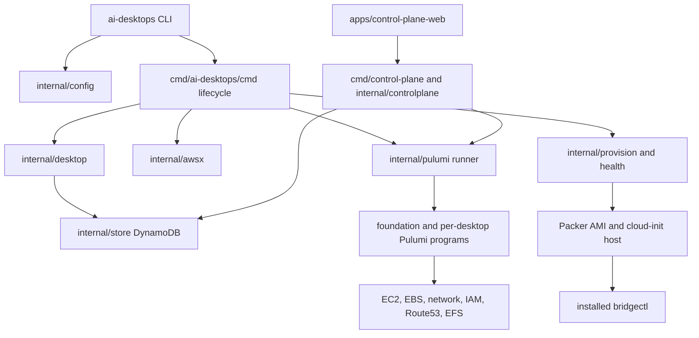
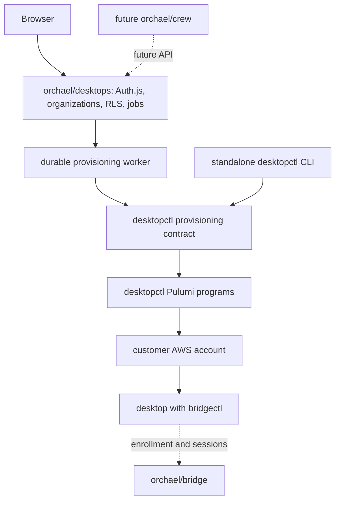
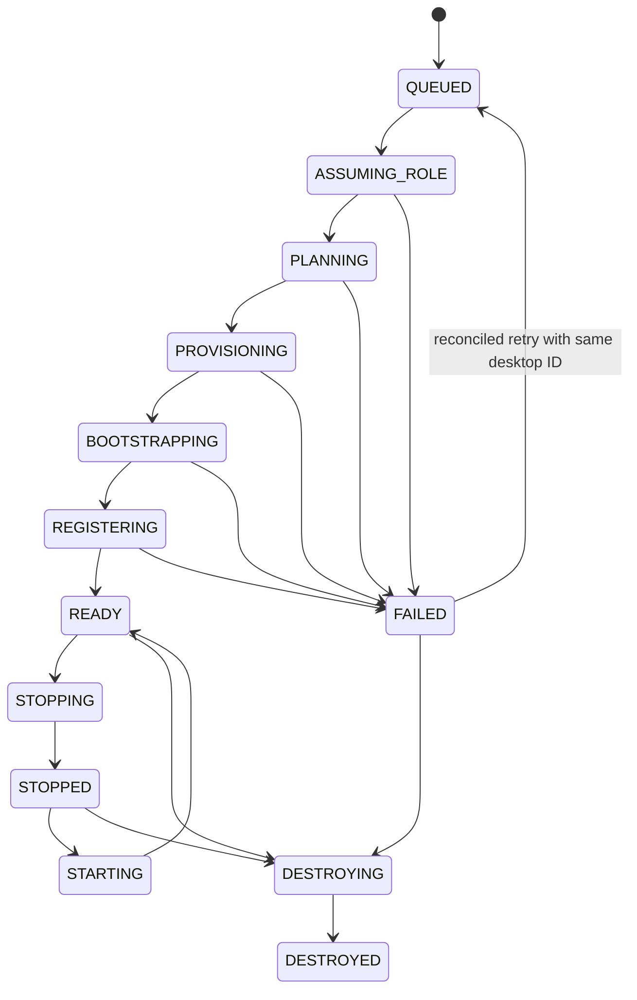

# desktopctl architecture and repository boundary

This document records the code as audited on 2026-10-04 and the target boundary for the first Orchael Desktops slice. The `ai-desktops` executable, `~/.ai-desktops` configuration, Pulumi stack names, AWS resource names, and on-host paths are compatibility contracts; the repository and Go module are `orchael/desktopctl` and `github.com/orchael/desktopctl`.

## Current system

The CLI is Cobra-based in `cmd/ai-desktops/cmd`. Its commands include `create`, `list`, `status`, `start`, `stop`, `terminate`, `bootstrap`, `init-foundation`, `destroy-foundation`, `check`, `doctor`, `resize`, `ssh`, `agent`, `secrets`, `workspace`, `ami`, `cost`, `purge`, and `version`. `terminate` is the current destroy operation. `--profile` selects a local AWS shared profile; `--desktop-profile` selects a desktop setup repository (`owner/repository[:path]`). Creation needs a GitHub owner (or a repository to infer it), configured foundation, and an AMI. The CLI remains independently usable without a SaaS account.

`infra/pulumi/foundation` creates shared VPC, subnet, security group, instance role/profile, EFS, DynamoDB, and DNS prerequisites. `infra/pulumi/desktop` owns an individual EC2 instance, root EBS volume, and Route53 record. `internal/pulumi` drives separate stacks through the Pulumi CLI. `internal/awsx` wraps AWS SDK calls for lifecycle, lookup, DNS, storage, and secrets. DynamoDB fleet records in `internal/store` index desktop state; Pulumi state remains the infrastructure record. `internal/desktop` manages record transitions and output mapping.

Packer, Ansible, and `internal/provision` prepare the AMI and cloud-init. They install developer tools, the on-desktop `apps/desktop-web` UI, and `bridgectl`; profiles are applied during bootstrap. `internal/health` and CLI doctor/readiness paths check the resulting host. `internal/agent` and `internal/tunnel` reach the installed bridgectl process. Bridge owns the remote device and session service; desktopctl stores no Bridge sessions.

The legacy hosted surface consists of `apps/control-plane-web` (Next.js, Auth.js Google login, Prisma/PostgreSQL users, organizations, memberships, invitations, and initial RLS), `cmd/control-plane` and `internal/controlplane` (Go fleet API), `infra/pulumi/control-plane-access`, `Dockerfile.control-plane`, Nginx, and deployment configuration. The web application proxies fleet requests to the Go API. That API accepts a bearer token and organization header, then filters DynamoDB records by organization. Its create handler runs Pulumi in the HTTP request, generates a new desktop ID for each attempt, and marks the record ready after Pulumi output mapping without the CLI's full bootstrap/readiness path. Its AWS loader uses static operator access keys to assume one control-plane role. This path is not the target multi-tenant provisioning worker.

## Component disposition

| Component | Decision | Reason and migration rule |
| --- | --- | --- |
| `cmd/ai-desktops`, `internal/config`, `internal/desktop` | **KEEP / REFACTOR** | Keep the standalone CLI and record semantics. Move lifecycle decisions out of Cobra into one reusable provisioning service; preserve existing flags and IDs. |
| `infra/pulumi/{foundation,desktop}`, `internal/pulumi`, `internal/awsx`, `internal/backend` | **KEEP / REFACTOR** | AWS infrastructure stays here. Add explicit temporary credential injection and account-scoped stack/backend configuration; avoid ambient worker credentials. |
| `internal/provision`, `internal/health`, `internal/packer`, `packer`, `ansible`, desktop profiles | **KEEP** | Runtime bootstrap, tools, and readiness belong with provisioning. |
| `internal/store` DynamoDB and `apps/desktop-web` | **KEEP** | DynamoDB serves independent CLI operators; the web app runs on the desktop itself. Neither is the SaaS tenant database. |
| `internal/agent`, `internal/tunnel`, bridgectl installation | **KEEP** | Install and reach bridgectl, while Bridge owns enrollment, devices, and sessions. |
| `apps/control-plane-web` Auth.js/org/membership data and UI | **MOVE** | Reuse tested ideas in `orchael/desktops`; move SaaS identity and tenant records there. Keep the deployed legacy app until replacement is proven. |
| `cmd/control-plane`, `internal/controlplane` HTTP API and `infra/pulumi/control-plane-access` | **REFACTOR**, then **REMOVE** | Existing API is synchronous and tied to one bootstrap role/key. Replace its useful lifecycle operations through the shared provisioning contract, then retire the legacy deployment separately. |
| `Dockerfile.control-plane`, Nginx, old hosted deployment configuration | **REMOVE after migration** | They serve the legacy hosted app. No removal belongs in the initial boundary PR. |
| Historical plans, migration names, AWS resource names, `ai-desktops` executable | **KEEP** | Preserve historical links and deployed compatibility; do not mechanically rename them. |

## Target dependency direction

Desktops owns users, organizations, customer AWS account records, the tenant PostgreSQL database with RLS, desired desktop state, and durable provisioning runs. It never stores customer access keys. Its worker assumes a customer role with STS using an external ID, then passes temporary credentials to desktopctl for both AWS SDK calls and Pulumi. The worker must use a stable desktop ID and per-desktop stack name across retries, reconcile live AWS/Pulumi state before declaring success, and record safe diagnostics. Pulumi must run outside Next.js requests.

The practical language boundary is a versioned CLI/job contract initially: a Next.js application cannot import Go, and `internal/` Go packages cannot be imported by another module. The worker invokes the desktopctl executable with structured input/output and temporary credentials in its process environment. The CLI and worker must ultimately call the same Go provisioning package. This decision avoids a second Pulumi implementation in TypeScript and allows the standalone CLI to continue working. The contract must cover create, status, stop, start, and destroy; account, region, profile, size, stable desktop ID, and idempotency key; progress and errors without secrets. The current CLI does **not** yet meet that contract. In particular, `--profile` is an AWS profile, not `developer`, `destroy` is named `terminate`, and create needs extra operator configuration.

## Lifecycle and failure boundary

The existing CLI retains failed instances for diagnosis; destroy must clean only the one desktop stack and reconcile partial creates. Desktops should report `READY` only after infrastructure and host checks pass. A failed run keeps its desktop identity and diagnostics. A retry returns to `QUEUED` only after reconciling the existing stack and live resources, then reuses that identity. Start/stop should observe EC2 state before committing tenant state. No Bridge session or Crew worker model belongs in either desktopctl or Desktops for this slice. A future desktop record may carry a Bridge device ID after bridgectl enrollment is available, but Desktops must link to Bridge rather than duplicate its storage or client.

## Validation inventory

The repository has Go unit tests in `cmd/` and `internal/`, Pulumi module tests, opt-in AWS integration/E2E suites in `tests/integration` and `tests/e2e`, Vitest and Playwright for the on-desktop web UI, and Vitest for the legacy hosted web UI. `go test ./...` passed before this documentation change. Docker, Compose, GoReleaser, and GitHub Actions cover CLI, web packages, control-plane containers, lint, and publishing. Real AWS tests are opt-in and must never be run by normal CI without explicit credentials and intent.
