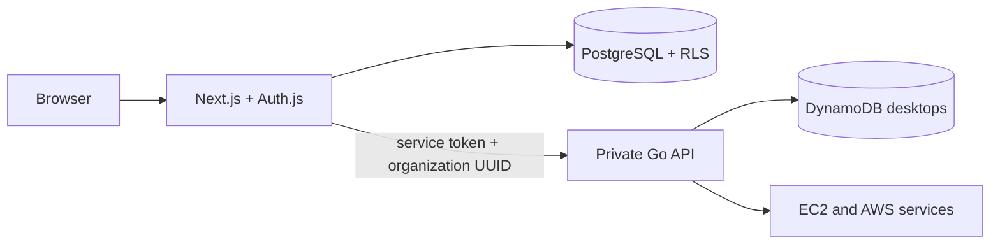

# Kubernetes Control Plane

The control plane is a Next.js 16 application backed by PostgreSQL and Auth.js. It authenticates users with Google, scopes every request to an active organization, and proxies fleet operations to a private Go API. Desktop metadata remains in DynamoDB with an `organization_id` UUID that matches the PostgreSQL organization.



## Identity and organizations

- Google is the only authentication provider.
- A first-time user receives an organization named from their normalized email, for example `alex@example.com` becomes `alex-example-com`.
- Users may belong to multiple organizations and select the active organization in the UI.
- Owners can rename an organization, invite by email, promote or demote members, and remove members.
- PostgreSQL rejects any operation that would leave an organization without an owner.
- PostgreSQL RLS restricts organization, membership, and invitation rows to the authenticated user and active organization.
- Legacy DynamoDB desktops without `organization_id` are intentionally hidden until migrated.

## Local development

Map `app.desktops.orchael.dev` to `127.0.0.1` in `/etc/hosts`, export the PEM
certificate and private key as `TLS_CERT_PEM` and `TLS_KEY_PEM`, set
`GOOGLE_CLIENT_ID` and `GOOGLE_CLIENT_SECRET` in your shell, then run:

```bash
docker compose -f docker-compose.dev.yaml up --build --watch
```

Compose starts PostgreSQL 17, applies Prisma migrations, starts the mock Go API,
and serves Next.js through nginx at `https://app.desktops.orchael.dev`. Compose
refuses to start when either TLS variable is unavailable, and nginx writes the
values only to its container filesystem. The proxy forwards WebSocket upgrades
for Next.js development live reload. Create a suitable local Auth.js secret for
anything beyond throwaway development:

```bash
export AUTH_SECRET="$(openssl rand -base64 32)"
```

Configure this Google OAuth redirect URI:

```text
http://localhost:3000/api/auth/callback/google
```

The development database is persisted in the `control-plane-postgres` volume. To reset local identity data, explicitly remove that volume with Docker Compose.

## Runtime configuration

| Variable | Component | Purpose |
|---|---|---|
| `DATABASE_URL` | Next.js | Restricted PostgreSQL runtime connection string. |
| `MIGRATION_DATABASE_URL` | Helm migration Job | Privileged PostgreSQL connection used only for schema migrations. |
| `AUTH_SECRET` | Next.js | Auth.js session signing/encryption secret. |
| `AUTH_TRUST_HOST` | Next.js | Trust ingress forwarding headers; Helm sets this to `true`. |
| `GOOGLE_CLIENT_ID` | Next.js | Google OAuth client ID. |
| `GOOGLE_CLIENT_SECRET` | Next.js | Google OAuth client secret. |
| `CONTROL_PLANE_API_URL` | Next.js | Cluster-private Go API base URL. |
| `CONTROL_PLANE_API_TOKEN` | Both | Service credential used only between Next.js and Go. |
| `AWS_REGION` | Go API | Fleet AWS region. |
| `OPERATOR_AWS_ACCESS_KEY_ID` | Go API | Bootstrap operator access key used only for STS. |
| `OPERATOR_AWS_SECRET_ACCESS_KEY` | Go API | Bootstrap operator secret used only for STS. |
| `OPERATOR_ROLE_ARN` | Go API | Fleet role assumed by the Go API. |

Do not expose the Go API ingress or its service token to browsers.

## Database migrations and RLS

Prisma schema changes live under `apps/control-plane-web/prisma`. Local development uses `pnpm run db:migrate:dev`; deployed environments use `pnpm run db:migrate`.

The migration connection must use a role allowed to create roles, tables, functions, triggers, and RLS policies. `DATABASE_URL` must use the non-owner `ai_desktops_app` role created or granted by the migration; `MIGRATION_DATABASE_URL` must never be supplied to the web Deployment. Runtime organization queries set transaction-local `app.current_user_id` and `app.current_organization_id` values before accessing protected tables. Never perform organization queries outside the provided organization helpers.

## Helm deployment

The chart is in `deploy/control-plane/chart`. It installs separate web and API Deployments, public ingress only for Next.js, a private API Service, a NetworkPolicy, and a pre-install/pre-upgrade migration Job.

Prefer creating the Secret with an external secret manager. The chart expects a Secret named `ai-desktops-control-plane` by default with these keys:

- `DATABASE_URL`
- `MIGRATION_DATABASE_URL`
- `AUTH_SECRET`
- `GOOGLE_CLIENT_ID`
- `GOOGLE_CLIENT_SECRET`
- `CONTROL_PLANE_API_TOKEN`
- `OPERATOR_AWS_ACCESS_KEY_ID`
- `OPERATOR_AWS_SECRET_ACCESS_KEY`

Example:

```bash
helm upgrade --install ai-desktops deploy/control-plane/chart \
  --namespace ai-desktops --create-namespace \
  --set image.repository=ghcr.io/orchael/ai-desktops-control-plane \
  --set image.tag=v0.2.0 \
  --set ingress.host=app.desktops.orchael.dev \
  --set config.operatorRoleArn="$OPERATOR_ROLE_ARN"
```

For an isolated test environment, `secrets.create=true` can create the Secret from Helm values, but command-line secret values may be retained in shell and Helm history.

The Google production redirect URI is:

```text
https://app.desktops.orchael.dev/api/auth/callback/google
```

## Private Go API contract

All `/api/desktops` requests require `X-Organization-ID` and, when configured, `Authorization: Bearer <CONTROL_PLANE_API_TOKEN>`. A desktop is returned only when its DynamoDB `organization_id` exactly matches the request header; missing and cross-organization records return `404`.

The Next.js `/api/fleet/*` route is the only browser-facing fleet endpoint. It obtains the active organization from an HTTP-only cookie, validates membership in PostgreSQL, and supplies both private headers to Go.

## Existing desktop migration

Existing records are hidden until an administrator writes a valid PostgreSQL organization UUID to their DynamoDB `organization_id` attribute. Determine the target organization with an owner before updating a record. There is no domain-based or automatic migration because that could disclose a desktop to the wrong tenant.

## Verification

```bash
go test ./...
cd apps/control-plane-web
pnpm run build
pnpm run test:coverage
pnpm run lint
pnpm run prettier
helm lint ../../deploy/control-plane/chart
```
