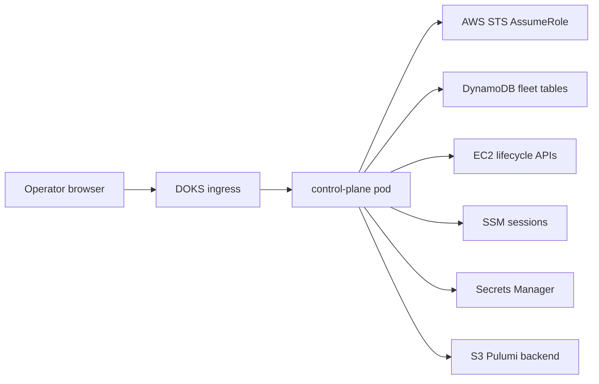

# Kubernetes Control Plane

The ai-desktops control plane is a long-running webapp for operating the AWS-backed desktop fleet from Kubernetes. It is separate from `apps/desktop-web`, which is the status dashboard served from each desktop.

The first deployment target is DOKS. Because DOKS does not provide AWS IRSA, the app uses a bootstrap IAM user stored in a Kubernetes Secret. That user can only assume a control-plane role. All fleet calls use temporary STS role credentials.

## Components



## Local Development

Start the API in mock mode:

```bash
CONTROL_PLANE_MOCK_AWS=true \
AI_DESKTOPS_CONFIG=config.example.yaml \
go run ./cmd/control-plane
```

Start the web UI:

```bash
cd apps/control-plane-web
pnpm install
pnpm run dev
```

The Vite dev server proxies `/api` and `/readyz` to `127.0.0.1:8080`.

## AWS Access Bootstrap

Create a stable external ID once:

```bash
openssl rand -hex 24
```

Configure and deploy the access stack:

```bash
cd infra/pulumi/control-plane-access
pulumi stack init control-plane-dev
pulumi config set aws:region us-east-2
pulumi config set environment dev
pulumi config set bootstrapUserName ai-desktop-user-dev
pulumi config set roleName ai-desktops-control-plane-dev
pulumi config set backendBucket <pulumi-state-bucket>
pulumi config set hostedZoneArn arn:aws:route53:::hostedzone/<zone-id>
pulumi config set desktopRoleArn arn:aws:iam::<account-id>:role/<desktop-instance-role>
pulumi config set --secret externalId <external-id>
pulumi up
```

The stack creates:

- IAM user `ai-desktop-user-<environment>` by default
- IAM access key for that user
- IAM role `ai-desktops-control-plane-<environment>`
- user policy allowing only `sts:AssumeRole` into that role
- role trust policy requiring the configured external ID
- role policy for ai-desktops fleet tables, EC2 lifecycle calls, SSM sessions, Route53 updates, Secrets Manager access, and the Pulumi S3 backend

Read the outputs:

```bash
pulumi stack output ROLE_ARN
pulumi stack output ACCESS_KEY
pulumi stack output --show-secrets SECRET
pulumi stack output --show-secrets EXTERNAL_ID
```

## DOKS Secret

Create the runtime secret:

```bash
kubectl create namespace ai-desktops
kubectl create secret generic ai-desktops-aws \
  --namespace ai-desktops \
  --from-literal=AWS_ACCESS_KEY_ID="$(pulumi stack output ACCESS_KEY)" \
  --from-literal=AWS_SECRET_ACCESS_KEY="$(pulumi stack output --show-secrets SECRET)" \
  --from-literal=AWS_REGION="us-east-2" \
  --from-literal=AWS_ROLE_ARN="$(pulumi stack output ROLE_ARN)" \
  --from-literal=AWS_EXTERNAL_ID="$(pulumi stack output --show-secrets EXTERNAL_ID)" \
  --from-literal=CONTROL_PLANE_API_TOKEN="$(openssl rand -hex 32)"
```

Do not commit a populated Secret manifest.

## Deploy

Build and push the image:

```bash
docker build -f Dockerfile.control-plane -t ghcr.io/<owner>/ai-desktops-control-plane:<tag> .
docker push ghcr.io/<owner>/ai-desktops-control-plane:<tag>
```

Update `deploy/control-plane/base/configmap.yaml` and `deploy/control-plane/base/deployment.yaml` for your environment and image, then apply:

```bash
kubectl apply -k deploy/control-plane/base
kubectl -n ai-desktops rollout status deploy/ai-desktops-control-plane
```

Check readiness:

```bash
kubectl -n ai-desktops exec deploy/ai-desktops-control-plane -- wget -qO- http://127.0.0.1:8080/readyz
```

## Runtime Configuration

| Variable | Source | Purpose |
|---|---|---|
| `AI_DESKTOPS_CONFIG` | ConfigMap mounted file | Path to the shared ai-desktops config. |
| `AI_DESKTOPS_ENVIRONMENT` | ConfigMap | Environment name. |
| `AWS_REGION` | ConfigMap or Secret | Fleet AWS region. |
| `AWS_ACCESS_KEY_ID` | Secret | Bootstrap IAM user access key ID. |
| `AWS_SECRET_ACCESS_KEY` | Secret | Bootstrap IAM user secret access key. |
| `AWS_ROLE_ARN` | Secret | Control-plane role to assume. |
| `AWS_EXTERNAL_ID` | Secret | External ID required by the role trust policy. |
| `CONTROL_PLANE_API_TOKEN` | Secret | Bearer token required for mutating fleet API calls. |
| `CONTROL_PLANE_ADDR` | ConfigMap | HTTP listen address. Defaults to `:8080`. |
| `CONTROL_PLANE_STATIC_DIR` | ConfigMap | Static web asset directory. |

## Current API

| Method | Path | Status |
|---|---|---|
| `GET` | `/healthz` | Implemented. |
| `GET` | `/readyz` | Implemented. Checks STS identity and DynamoDB list access. |
| `GET` | `/api/desktops` | Implemented. |
| `GET` | `/api/desktops/{id}` | Implemented. Includes best-effort live EC2 state. |
| `POST` | `/api/desktops/{id}/refresh` | Implemented. Reconciles stopped/running state from EC2. |
| `POST` | `/api/desktops/{id}/start` | Implemented without DNS refresh. |
| `POST` | `/api/desktops/{id}/stop` | Implemented. |
| `POST` | `/api/desktops` | Deferred until CLI create logic is extracted into a shared service. |
| `POST` | `/api/desktops/{id}/terminate` | Deferred until Pulumi destroy is extracted into a shared service. |

All `POST` endpoints require `Authorization: Bearer <CONTROL_PLANE_API_TOKEN>` unless the server is running with `CONTROL_PLANE_MOCK_AWS=true`.

## Rotation

1. Run `pulumi up` in `infra/pulumi/control-plane-access` after replacing the access key resource or rotating manually in IAM.
2. Update the `ai-desktops-aws` Kubernetes Secret with the new key.
3. Restart the deployment:

```bash
kubectl -n ai-desktops rollout restart deploy/ai-desktops-control-plane
```

4. Confirm `/readyz` returns `ok: true`.

## Troubleshooting

- `/readyz` reports `AccessDenied` from STS: verify `AWS_ROLE_ARN`, `AWS_EXTERNAL_ID`, and the role trust policy.
- `/readyz` reports DynamoDB errors: verify `fleet.table_name` and the role policy table ARNs.
- Fleet rows load but start/stop fails: verify EC2 permissions and that the desktop record has an `instance_id`.
- The browser loads but API calls 404: verify ingress forwards `/api` and `/readyz` to the control-plane Service.
