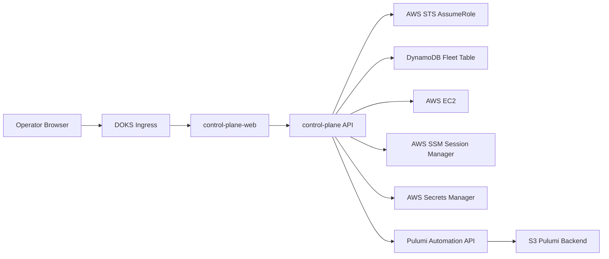

# Plan 18 - Kubernetes Control Plane Webapp

## Objective

Build a Kubernetes-hosted control plane webapp for `ai-desktops` that runs outside AWS, initially on DOKS, and manages the existing AWS-backed desktop fleet through the same lifecycle semantics as the CLI.

This is a new fleet control plane. It must not replace `apps/desktop-web`, which is the on-desktop status dashboard served from each provisioned desktop.

Tracker: https://github.com/markcallen/ai-desktops/issues/156

## GitHub Actions Review

Existing workflows that relate to webapp work:

| Workflow | Relevance |
|---|---|
| `.github/workflows/ci.yml` | Builds, tests, coverage-checks, and Playwright-smoke-tests `apps/desktop-web`. Add the control plane app to this workflow once scaffolded. |
| `.github/workflows/lint.yml` | Runs ESLint and Prettier for `apps/desktop-web`. Add a parallel control plane lint job. |
| `.github/workflows/publish-desktop-web.yml` | Reusable package publish for `@markcallen/desktop-web`; useful pattern, but it targets the on-desktop app. The control plane should publish a container image instead. |
| `.github/workflows/publish.yml` | Bumps CLI and desktop-web versions and calls both publish workflows. Extend only if the control plane shares release cadence. |

No current workflow builds or publishes a Kubernetes-deployable control plane image. The existing web workflows only cover the Vite status dashboard in `apps/desktop-web`.

## Depends On

- Plan 03 (Pulumi backend bootstrap)
- Plan 04 (foundation stack)
- Plan 05 (DynamoDB fleet store)
- Plan 07 (lifecycle commands)
- Plan 11 (bridge tunnel agent control), for eventual remote agent operations
- Plan 17 (GitHub developer tooling), for owner-scoped secret conventions

## Scope

Create:

- `apps/control-plane-web` for the browser UI.
- `cmd/control-plane` or `apps/control-plane-api` for the server API, depending on implementation fit after code review.
- Shared lifecycle service code that reuses existing config, AWS SDK helpers, store models, and Pulumi wrapper behavior instead of shelling out to the CLI.
- Container image build path and Kubernetes manifests or Helm chart under `deploy/control-plane`.
- Pulumi-managed AWS IAM bootstrap for DOKS credentials.
- Documentation for local development, DOKS deployment, IAM bootstrap, secret rotation, and rollback.

## Non-Goals

- Do not expose raw AWS access keys in browser responses, logs, HTML, config maps, or frontend bundles.
- Do not make `apps/desktop-web` the fleet control plane.
- Do not store Pulumi state in Kubernetes.
- Do not expose `ai-agent-bridge` publicly; keep bridge access through SSM, SSH, or a later authenticated private network mode.
- Do not implement full multi-tenant RBAC in the first cut; leave clean authorization boundaries for it.

## Architecture



The API runs with static bootstrap credentials stored as a Kubernetes Secret because DOKS cannot use AWS IRSA. Those credentials belong to a narrowly scoped IAM user whose only high-value permission is `sts:AssumeRole` into the control plane role. Runtime AWS clients must assume the role and use temporary credentials.

## AWS IAM Bootstrap for DOKS

Add a small provisioning path that creates:

- IAM role: `ai-desktops-control-plane-<environment>`.
- IAM user: `ai-desktops-control-plane-<environment>`.
- IAM access key for the user.
- Policy on the user allowing only `sts:AssumeRole` for the control plane role.
- Trust policy on the role allowing only the bootstrap user to assume it, with an external ID condition.
- Least-privilege policies on the role for fleet operations.
- Pulumi outputs for the role ARN, user name, access key ID, secret access key, external ID, region, fleet table, and backend bucket.

The secret access key output must be marked as a Pulumi secret. It should be installed into DOKS as a Kubernetes Secret, not committed:

```bash
kubectl create secret generic ai-desktops-aws \
  --namespace ai-desktops \
  --from-literal=AWS_ACCESS_KEY_ID='<pulumi-output-access-key-id>' \
  --from-literal=AWS_SECRET_ACCESS_KEY='<pulumi-output-secret-access-key>' \
  --from-literal=AWS_REGION='<region>' \
  --from-literal=AWS_ROLE_ARN='<control-plane-role-arn>' \
  --from-literal=AWS_EXTERNAL_ID='<external-id>'
```

Runtime credential flow:

1. API reads the bootstrap key from environment variables mounted from the Kubernetes Secret.
2. API calls `sts:AssumeRole` with `AWS_ROLE_ARN` and `AWS_EXTERNAL_ID`.
3. API uses temporary role credentials for DynamoDB, EC2, SSM, Secrets Manager, Route53, S3 state backend access, and Pulumi operations.
4. API refreshes temporary credentials before expiration.

Initial role permissions:

- DynamoDB read/write on the configured fleet table and AMI history table.
- EC2 describe/start/stop/terminate/run-instance actions required by existing lifecycle operations, constrained by `managed-by=ai-desktops` tags where AWS supports it.
- IAM `PassRole` only for the existing desktop instance role.
- SSM session permissions for managed desktop instances.
- Secrets Manager read/write for `/ai-desktops/<owner>/*`, preserving the existing operator-secret deny boundary for desktop instance roles.
- Route53 record changes only for the configured hosted zone.
- S3 access only to the configured Pulumi backend bucket and prefix.
- CloudWatch Logs write access for control plane operational logs if the app exports logs directly.

## Implementation Plan

### 1. Confirm backend shape

- Audit `internal/config`, `internal/store`, `internal/awsx`, `internal/pulumi`, and command handlers.
- Identify CLI logic that can be lifted into reusable services without changing CLI behavior.
- Define the API boundary around fleet list, desktop detail, create, start, stop, terminate, status refresh, and operation history.

### 2. Add control plane server

- Prefer Go for the API if lifecycle logic can be reused directly.
- Expose REST endpoints under `/api`.
- Add structured request IDs and audit logging for every mutating operation.
- Use server-side session/auth middleware; keep cloud credentials server-only.
- Add unit tests for request validation, auth decisions, operation dispatch, and AWS credential provider setup.

### 3. Add control plane web UI

- Create a new Next.js app under `apps/control-plane-web`.
- Show fleet list, lifecycle state, hostnames, readiness summaries, and recent operation results.
- Add desktop detail actions for start, stop, terminate, and refresh.
- Make destructive operations require explicit confirmation.
- Keep UI dense and operational; this is a fleet tool, not a marketing site.

### 4. Add Kubernetes deployment

- Add a production Dockerfile for the API plus static web assets.
- Add manifests or Helm chart under `deploy/control-plane` with Deployment, Service, Ingress, ConfigMap, Secret references, readiness probe, liveness probe, resource requests, and network policy.
- Support configuration through environment variables and mounted secrets.
- Document DOKS setup, ingress assumptions, TLS, and secret creation.

### 5. Add IAM provisioning

- Add `infra/pulumi/control-plane-access` or extend the foundation stack only if the blast radius is acceptable.
- Keep access-key creation explicit and documented because this creates long-lived credentials.
- Output key material as Pulumi secrets.
- Add a rotation command or documented rotation runbook.
- Add tests for policy document generation where practical.

### 6. Add CI and publish workflows

- Extend `.github/workflows/ci.yml` to build and test the control plane API and web app.
- Extend `.github/workflows/lint.yml` for control plane linting and formatting.
- Add a container publish workflow for the control plane image.
- Add a smoke test that starts the container with mock AWS endpoints or fake providers and verifies `/healthz`, `/readyz`, and a mock fleet list.

### 7. Update docs

- Update `ARCHITECTURE.md` to show the new long-running control plane.
- Update `README.md` with deployment prerequisites and DOKS install flow.
- Add `docs/control-plane.md` with IAM, Kubernetes, configuration, operations, and rotation details.
- Add troubleshooting steps for failed AWS role assumption, Pulumi backend access, and DynamoDB permissions.

## API Surface

Initial endpoints:

| Method | Path | Purpose |
|---|---|---|
| `GET` | `/healthz` | Process health. |
| `GET` | `/readyz` | Config, AWS STS, and store readiness. |
| `GET` | `/api/desktops` | List fleet records. |
| `GET` | `/api/desktops/{id}` | Fetch one desktop with live status summary. |
| `POST` | `/api/desktops` | Deferred until CLI create logic is extracted into a shared service. |
| `POST` | `/api/desktops/{id}/start` | Start a stopped desktop. |
| `POST` | `/api/desktops/{id}/stop` | Stop a running desktop. |
| `POST` | `/api/desktops/{id}/terminate` | Deferred until Pulumi destroy is extracted into a shared service. |
| `POST` | `/api/desktops/{id}/refresh` | Reconcile DynamoDB with live AWS instance state. |

## Configuration

Required runtime environment:

| Variable | Source | Purpose |
|---|---|---|
| `AI_DESKTOPS_ENVIRONMENT` | ConfigMap | Environment name such as `dev`, `test`, or `prod`. |
| `AI_DESKTOPS_CONFIG` | ConfigMap or mounted file | Existing ai-desktops config content or path. |
| `AWS_REGION` | Secret or ConfigMap | AWS region for the fleet. |
| `AWS_ACCESS_KEY_ID` | Secret | DOKS bootstrap IAM user key ID. |
| `AWS_SECRET_ACCESS_KEY` | Secret | DOKS bootstrap IAM user secret. |
| `AWS_ROLE_ARN` | Secret or ConfigMap | Control plane role to assume. |
| `AWS_EXTERNAL_ID` | Secret | External ID required by the role trust policy. |
| `SESSION_SECRET` | Secret | Web session signing/encryption secret. |

## Acceptance Criteria

- A clean checkout can build the control plane API and UI locally.
- CI builds, tests, and lints the control plane.
- A container image is produced and can run with mock AWS dependencies.
- Kubernetes manifests deploy the app to a namespace without embedding secrets.
- The API assumes the AWS role at runtime and never uses bootstrap user credentials directly for fleet calls.
- The IAM user can only assume the configured role.
- The IAM role can perform required fleet lifecycle operations and no broad administrator policy is attached.
- `GET /readyz` fails clearly when STS assume-role, DynamoDB, or Pulumi backend access is unavailable.
- Docs include DOKS deployment and credential rotation.

## Verification

Expected local checks after implementation:

```bash
go test ./...

cd apps/control-plane-web
pnpm install --frozen-lockfile
pnpm run build
pnpm run test
pnpm run test:coverage
pnpm run lint
pnpm run prettier
```

Expected deployment checks:

```bash
kubectl -n ai-desktops rollout status deploy/ai-desktops-control-plane
kubectl -n ai-desktops exec deploy/ai-desktops-control-plane -- wget -qO- http://127.0.0.1:8080/readyz
```

Expected IAM checks:

```bash
aws sts assume-role \
  --role-arn "$AWS_ROLE_ARN" \
  --role-session-name ai-desktops-control-plane-check \
  --external-id "$AWS_EXTERNAL_ID"
```

## Open Decisions

- Whether the server should be a Go binary serving static assets or a separate Node API plus Vite frontend. The default should be Go if it avoids duplicating lifecycle logic.
- Whether to extend the foundation stack or add a separate `control-plane-access` Pulumi program. The default should be a separate stack to avoid surprising changes to existing foundation deployments.
- Which authentication provider protects the browser UI in the first deployment. At minimum, put the app behind an ingress-level auth layer or add server-side session auth before exposing it beyond a private network.
